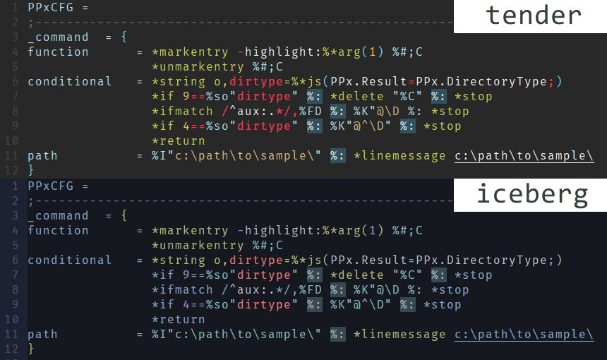

# vim-PPxcfg

PPx設定ファイル用のvimシンタックスハイライトです。  

一行目に`PPxCFG =`(スペース含む)と書かれた拡張子`.cfg`ファイルをファイルタイプ`PPxcfg`と定義し、
シンタックスハイライトを適用します。雑な作りなので不要な部分がハイライトされることがままあります。  
また、Filetypeをトリガーとした遅延読み込みには対応していません。



## インストール

#### vim-plug

```vim
call plug#begin()
Plug 'tar80/vim-PPxcfg'
call plug#end()
```

#### dein

```vim
call dein#begin()
call dein#add('tar80/vim-PPxcfg')
call dein#end()
```

プラグインマネージャーを使わない場合は、以下の方法で適用されます。

1. このリポジトリをローカルにダウンロード。
1. vimで`echo &rtp`を実行。
1. `path\to\after`がいくつかあると思うので都合のいいところに  
   `ftdetect`、`ftplugin`、`syntax`を放り込む。
